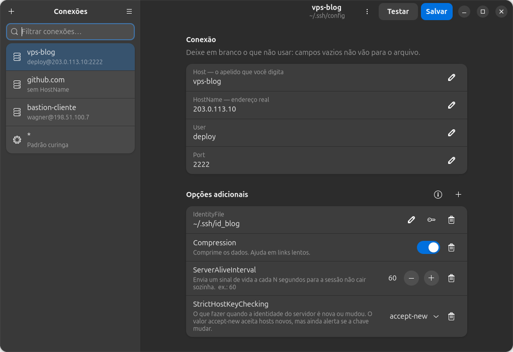
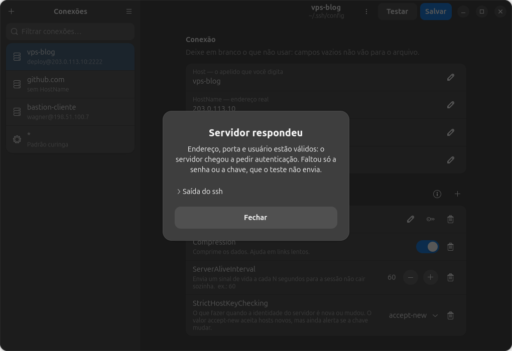
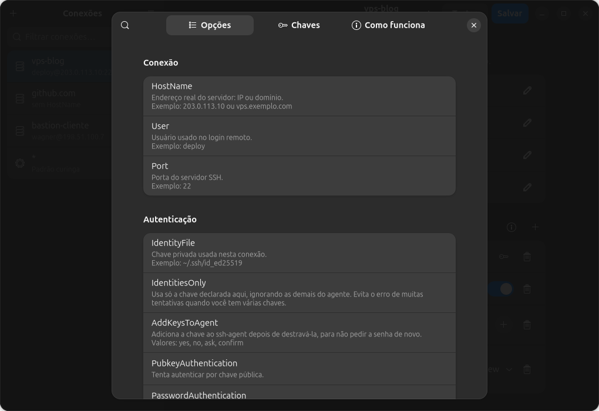

# ParvuSsh

**Gerencia suas conexões SSH lendo e escrevendo o seu `~/.ssh/config` de
verdade.** Sem banco paralelo, sem formato proprietário, sem etapa de
importação.

*Parvus*, do latim: pequeno. O nome é a lista de não-objetivos em uma palavra.



---

## Para quem é

Para quem cuida de alguns servidores e cansou de abrir o `~/.ssh/config` num
editor de texto só para lembrar qual apelido usou.

E para quem está começando: os campos usam o **nome real das opções do
OpenSSH**, com uma explicação em português ao lado. Você pode procurar no
`man ssh_config` exatamente o que está vendo na tela. A ideia não é esconder o
SSH de você — é te apresentar a ele.

## O que ele faz

- Lista, filtra e edita as conexões do seu `~/.ssh/config`
- Catálogo de 50 opções do SSH, buscáveis **pelo que fazem**: digite `chave`,
  `bastion` ou `sessão` e veja o que aparece
- Cria chaves `ed25519`, `ecdsa` ou `rsa` e escolhe qual usar em cada conexão
- Testa a conexão **antes de salvar**, e explica em português o que deu errado
- Guia passo a passo de como criar uma chave e instalá-la num servidor

### O teste de conexão diz coisa útil



Repare no veredito: *"Servidor respondeu"* é um **sucesso**, mesmo o ssh tendo
recusado o login. Chegar até o pedido de autenticação já prova que o endereço,
a porta, o usuário e a rede estão certos — que é exatamente o que você queria
saber. O que faltou foi a senha ou a chave, que o teste não envia de
propósito.

Quando falha, ele diz por quê: nome não resolvido, porta fechada, firewall no
caminho, ou a identidade do servidor mudou. A saída crua do `ssh` fica ali
embaixo, dobrada, para quem quiser.

### A ajuda é parte do aplicativo



`F1` abre o catálogo inteiro com busca, um guia de seis passos sobre chaves
(criar, instalar, permissões, fechar a senha, usar o agente, e o que fazer
quando falha) e uma página explicando como o arquivo funciona — incluindo a
regra que mais surpreende: **o OpenSSH usa a primeira definição que encontrar**,
não a última.

---

## O contrato com o seu arquivo

Esta é a parte que ganha ou destrói a sua confiança. Cada item abaixo tem um
teste automatizado que falha se for quebrado.

1. **Bloco que você não editou volta byte por byte.** Só o bloco editado é
   reescrito. Indentação, espaçamento e ordem ficam como estavam.
2. **Comentários sobrevivem.** Cada comentário pertence à linha logo abaixo
   dele e viaja junto com ela.
3. **Opções desconhecidas sobrevivem.** Uma opção que não está no nosso
   catálogo vira um campo de texto comum. Nunca é descartada por ser
   desconhecida.
4. **Backup antes de cada gravação**, em `<config>.bak-AAAAMMDD-HHMMSS`. O
   aplicativo nunca apaga esses backups.
5. **Validação antes de gravar.** O conteúdo vai para um arquivo temporário e
   passa por `ssh -G`. Se o ssh recusar, **nada** é gravado e a mensagem dele
   aparece para você.
6. **Gravação atômica.** Arquivo temporário na mesma pasta, `chmod 600`,
   `os.replace`. Ou o arquivo antigo está lá, ou o novo — nunca metade.
7. **Nunca escrevemos num arquivo que não lemos.** Os arquivos trazidos por
   `Include` são editáveis justamente porque foram carregados; nada além
   disso é tocado.

Um detalhe do mesmo espírito: se uma opção tiver um valor que o widget certo
não conseguiria guardar — `ConnectTimeout 99999`, `Compression maybe` — ela
aparece como texto puro em vez de virar um seletor que truncaria o valor no
próximo Salvar.

---

## Instalação

Ubuntu 26.04 ou equivalente, GNOME 50. Mínimo: Python 3.11, GTK 4.12,
libadwaita 1.5.

```bash
git clone https://github.com/wagnerbugs/parvussh.git
cd parvussh
make setup
```

O `make setup` instala as dependências do sistema e cria o `.venv`. Não há
dependências de runtime no PyPI: o PyGObject vem da distribuição de propósito,
porque é o caminho que funciona sem dor de compilação.

Para abrir pelo menu do GNOME, em vez de pelo terminal:

```bash
make install-user
```

Instala o `.desktop` e os ícones em `~/.local/share`. Sem `sudo`, nada fora da
sua pasta pessoal é tocado. Para desfazer: `make uninstall-user`.

---

## Uso

```bash
make run
```

| Atalho | O que faz |
|---|---|
| `Ctrl+N` | nova conexão |
| `Ctrl+S` | salvar |
| `F1` | ajuda |

### Idioma

A interface existe em **português e inglês**, e escolhe sozinha a partir do seu
sistema (`LC_ALL`, `LC_MESSAGES` ou `LANG`). Trocar o idioma do GNOME troca o
do aplicativo junto — é como aplicativos GNOME funcionam, e por isso não há
seletor de idioma dentro dele.

Para uma execução avulsa:

```bash
PARVUSSH_LANG=en make run     # inglês
PARVUSSH_LANG=pt_br make run  # português
```

Para fixar no lançador do menu, sem mexer no sistema:

```bash
make install-user PARVUSSH_LANG=en
```

Sem o argumento, `make install-user` volta a seguir o sistema. Um idioma que o
aplicativo não fala é recusado com a lista dos que ele fala.

### Testando sem arriscar o seu arquivo

Enquanto você não confia no aplicativo, aponte ele para um `HOME` descartável:

```bash
mkdir -p /tmp/parvussh-teste/.ssh && chmod 700 /tmp/parvussh-teste/.ssh
cp ~/.ssh/config /tmp/parvussh-teste/.ssh/config
HOME=/tmp/parvussh-teste .venv/bin/python -m parvussh
```

O aplicativo resolve tudo a partir de `Path.home()`, então ele lê e grava
apenas dentro de `/tmp/parvussh-teste/.ssh`. Edite, salve, quebre à vontade, e
compare com `diff`. Seu arquivo real fica intocado.

### Se mexer no arquivo real e se arrepender

```bash
ls -lt ~/.ssh/config.bak-*                            # o mais recente primeiro
diff ~/.ssh/config ~/.ssh/config.bak-20260728-183000
cp ~/.ssh/config.bak-20260728-183000 ~/.ssh/config    # voltar atrás
```

---

## Limitações conhecidas

**A senha da chave aparece no `ps` por um instante.** Ao criar uma chave, o
aplicativo passa a senha como argumento para o `ssh-keygen`, então outro
usuário logado na mesma máquina consegue vê-la enquanto o comando roda. Num
desktop pessoal isso é aceitável. Se não for o seu caso, crie a chave no
terminal — `ssh-keygen -t ed25519 -C "seu-nome@notebook"` — e depois use o
botão de chave para selecioná-la.

**Blocos `Match` são somente leitura.** Eles são lidos, preservados e gravados
de volta intactos, mas não aparecem na lista nem podem ser editados pela
interface. Edite-os no seu editor de texto; o aplicativo não vai atrapalhar.

---

## Filosofia

O formato é o `ssh_config`, sempre. O aplicativo é uma janela para um arquivo
que já era seu antes de ele existir, e continua sendo depois. Se você desinstalar
o ParvuSsh amanhã, nada quebra — suas conexões continuam funcionando no
terminal, no `scp`, no `rsync` e no Git, porque nunca deixaram de morar onde
sempre moraram.

Isso é o oposto de um gerenciador que importa suas conexões para um banco
próprio. Aquele modelo pede confiança e cobra dependência. Este pede confiança
uma vez, na hora de gravar, e devolve o controle em seguida.

## Não-objetivos

Estas coisas não vão entrar. A lista curta é o que mantém o aplicativo pequeno,
e pedidos que caem nela são fechados com um obrigado.

- Terminal embutido
- Orquestração de túneis e port-forward (as opções existem no formulário;
  gerenciar sessões vivas é outro produto)
- Cofre de senhas — isso é o `ssh-agent` e o chaveiro do sistema
- Sincronização na nuvem, contas, telemetria
- Navegação SFTP, edição remota de arquivos
- Um formato próprio de configuração
- Abstrair o SSH: os rótulos usam os nomes reais das opções de propósito

---

## Desenvolvimento

| Comando | O que faz | Precisa de tela? |
|---|---|---|
| `make run` | abre o aplicativo | sim |
| `make test` | testes de lógica pura, rápidos | não |
| `make test-gui` | testes de interface, sob `xvfb` | não |
| `make lint` | `ruff check` + `ruff format --check` | não |
| `make check` | os três acima, em ordem | não |
| `make screenshots` | regera as imagens deste README | não |

Rode `make check` antes de cada commit. Veja
[`CONTRIBUTING.md`](CONTRIBUTING.md) — em inglês, como todo o código.

## Licença

GPL-3.0-or-later. Veja [`LICENSE`](LICENSE).
