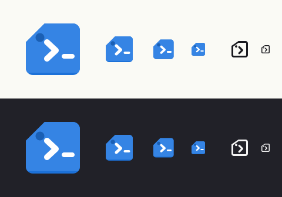

# Icons



Regenerate that image with `make icon-preview`. It reads the committed SVGs, so
it cannot drift from what the app ships.

## Metaphor

A tag. The app's actual job is giving a machine a name a human can remember —
the whole reason it exists is that `Host` aliases are easy to forget. The `>`
prompt inside the tag says SSH without resorting to a padlock or a key.

Two readings, both on message: a luggage tag (naming a thing) and a document
with a folded corner (the app is a window onto a file). Either one is correct.

Deliberately **not** a key or a padlock — every password manager already owns
that symbol, and the HIG is explicit that app icons should be unique to each
app.

## Compliance with the GNOME HIG

| Rule | How this icon satisfies it |
|---|---|
| 128×128 canvas, does not fill it | Artwork occupies x 24–116, y 20–108 |
| Depth from a "top" plus a darker "front" profile, not a tilt | Bottom 4px band in Blue 4 under the Blue 3 top surface |
| Front profile no taller than 4 nominal px | Exactly 4px |
| Flat colors on straight surfaces, gradients only on curved ones | No gradients at all |
| No shadows outside the silhouette | None — GNOME draws those itself |
| 2px grid | Every coordinate is even, except the eyelet radius (7.5) and the cursor pill |
| Legible down to 32×32 | Verified by rasterising at 128/64/48/32 |
| Symbolic version, same metaphor | Same tag, same chevron, detail removed |

Palette entries used, all from the standard GNOME palette:

| Role | Name | Hex |
|---|---|---|
| Top surface | Blue 3 | `#3584e4` |
| Front profile | Blue 4 | `#1c71d8` |
| Eyelet | Blue 5 | `#1a5fb4` |
| Prompt | Light 1 | `#ffffff` |

## Symbolic version

Outlined rather than solid, with the cursor bar dropped: at 16px the tag
outline, the eyelet and the chevron are already at the limit of what survives,
and the HIG warns against excess detail at small sizes. GTK recolors the black
fill automatically, so the file stays monochrome.

## Files

```
data/icons/hicolor/scalable/apps/io.github.wagnerbugs.ParvuSsh.svg
data/icons/hicolor/symbolic/apps/io.github.wagnerbugs.ParvuSsh-symbolic.svg
```

Both names must match the app ID exactly. If the app ID changes, these files
change with it, along with the `.desktop` and `.metainfo.xml` names.

## Checking a change

```bash
make icon-preview
```

`tools/icon_preview.py` rasterises both files at every size that matters, on a
light and a dark backdrop, and stands in for GTK's symbolic recolouring so the
monochrome version is judged the way the shell will actually draw it. It goes
through librsvg's GObject bindings, which PyGObject already provides — no
`librsvg2-bin` needed.

**The 32px render is the one that decides whether a detail earns its place.**
Judge there, not at 128.

Two things verified by hand when these landed, worth repeating after any edit:

- `Gtk.IconTheme.lookup_icon(...).is_symbolic()` returns `True` and the artwork
  recolours. GTK keys that off the `-symbolic` suffix and the `symbolic/`
  directory, not off the fill colour, so `fill="#000"` is fine.
- The app icon still reads at 32px, where the chevron is four pixels wide.

For real-context previews (dock, app grid, GNOME Software, nightly variant),
[App Icon Preview](https://flathub.org/apps/details/org.gnome.design.AppIconPreview)
is the tool the GNOME designers use. Worth installing before the first release.

## If you want to iterate

The riskiest thing to change is the chevron weight. At `stroke-width` below 8
it disappears at 32px; above 12 it crowds the eyelet. The current value is 10.
